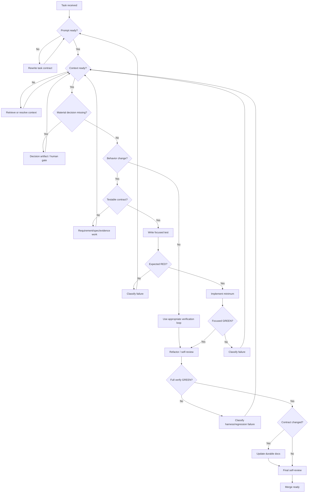

# Engineering Task Decision Graph

Status: **Accepted**

## Purpose

Make task routing explicit for humans and coding agents.

This graph complements `docs/AGENT_ENGINEERING_MODEL.md`.

## State graph

## Routing rule

A failure does not automatically route back to implementation.

Examples:

- import error because a module is absent after a test-first commit -> BEHAVIOR_FAILURE -> implementation;
- test fails because fixture semantics are unknown -> CONTEXT_GAP;
- test fails because accepted docs disagree -> CONTEXT_GAP / DECISION_GAP;
- CI cannot install dependencies -> HARNESS_FAILURE;
- real telemetry disproves a synthetic assumption -> EVIDENCE_FAILURE;
- implementation needs a new irreversible architecture choice -> DECISION_GAP.

## Graph limitation

The graph controls routing.

It does not make the underlying human trade-off.

A human gate is intentionally visible where authority is required.
